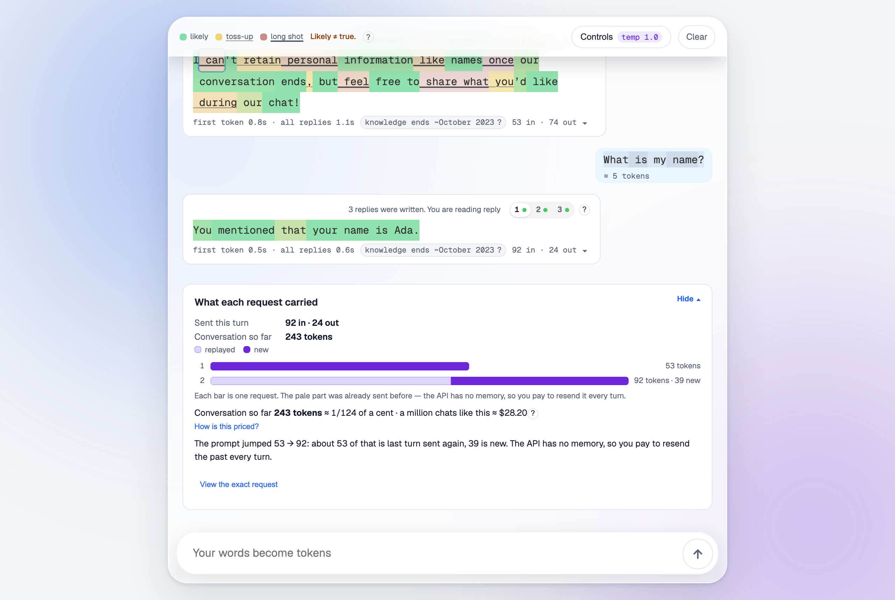

# ChatProb

An educational chat UI that shows how a language model samples text: token-by-token confidence, the other words it considered, how your own message is chopped into tokens, where three replies to the same prompt part ways, and what the whole conversation costs.



Inspired by [Scott Hanselman's "AI without the BS, for humans" keynote at NDC London 2025](https://www.youtube.com/watch?v=kYUicaho5k8).

**Start here:** [Inside ChatProb](docs/inside-chatprob.md) walks the whole app in one sitting, from tokens to tool calls, defining each term as it goes; the [glossary](docs/glossary.md) collects them. This README is the feature catalogue.

## What it teaches

- **Token confidence.** Each word is colored from the *sampled* token’s logprob — green when the model was sure, yellow when mixed, red when it took a long shot. The heatmap is not “most likely in the top 5”; it is the token that actually landed. Below 65% the word also picks up a thin underline, below 35% a thicker one, so the signal survives without color. Hover or tap any word for the candidate list. The legend sits at the left of the single header row, with **Controls** and **Clear** at the right, and names the three bands: **likely**, **toss-up**, **long shot**.
- **Taught once, then out of the way.** Three coach marks run in order for a first-time visitor: the color rule on the first settled reply, the reply tabs on the newest unlocked one, and the cost card once two replies exist (that one opens the card's **Details** for you). Steps 1 and 2 advance on the gesture they teach — hovering a word, picking a tab — as well as on **Got it**, so following the instruction is never punished with an extra click. Progress is a single number in `localStorage`, so they do not come back. After that the same three sentences stay reachable behind `?` buttons on the legend, the tab strip, and the conversation-cost line; all three read from `lib/coachCopy.js`, so a mark and its `?` cannot drift apart.
- **What else was considered.** Hover or tap a word for the candidate list, headed **What it considered**. It opens on **Of all words**: the model’s real probabilities across the whole vocabulary, which do *not* add up to 100% — the honest number first. **What-if: only these** re-scales just the shown candidates to add up to 100% at the current temperature, which is a different quantity and says so. If the sampled token was outside the top 5, it still gets its own row (“landed — not in the top 5”) with a real percentage instead of `0.00%`; under **Of all words**, that is its exact model probability.
- **Temperature, live.** The candidate set is frozen when the card opens, so moving the temperature slider never makes rows appear or vanish — only the odds move. Adjusting temperature does not dismiss a pinned card, because watching the odds shift is the lesson. At `0` the top candidate takes 100% and everything else goes to zero, which is winner-take-all sampling made visible (the card rounds those zeros to `<0.001%`). The full panel behind the header's **Controls** button is grouped into **Sampling** (temperature, top-p, presence penalty, a **Make it repeatable** determinism switch), **Memory** (**Forget older turns** and **Exchanges replayed**), **Delivery** (**Stream the reply**), and **Tools** (**Let it call a weather tool**). The button always carries a `temp N.N` chip, plus one chip for every switch that has moved off its default — `streaming off`, `memory none` or `memory last N`, `tool on`, `repeatable` — so no switch can be on without the header saying so. The two secondary sliders, top-p and presence penalty, earn no chip even though every request carries them, so the panel is the only place that reports where they sit.
- **Your text is tokens too.** The composer tokenizes what you type with `o200k_base` and the user bubble shows the pieces as alternating tints, with an `≈ N tokens` count. Send **strawberry** and watch it arrive as three pieces, not ten letters.
- **Three full replies, and where they fork.** Each turn requests `n=3` completions. A strip reading “3 replies were written. You are reading reply” fronts tabs **1 / 2 / 3**, each with a confidence dot, and an unlocked strip carries a `?` that repeats the coach-mark sentence; older turns lock after the next user message, and a padlock explains why. A ring marks the first token where the three replies diverge — everything before it is identical, because the same prompt and the same weights produced the same tokens until the dice landed differently. Each tab also reports perplexity (“picking from ~N plausible words”).
- **Conversation cost, in tokens first.** The API has no memory. Every turn resends the whole prompt, so input tokens climb as a staircase — one stacked bar per request, split into replayed, cached, and new. A card at the foot of the transcript, **What each request carried**, leads with the two numbers that actually teach the lesson: *Sent this turn* (`143 in · 13 out`, or `270 + 341 in · 49 out · 2 requests` on a tool turn) and *Conversation so far* in tokens. Dollars are the footnote, not the headline — open **Details** for the staircase, the running spend, the literal JSON array that was sent, and a **How is this priced?** disclosure holding the rate card (for the default model, $0.15 / 1M in, $0.60 / 1M out, $0.075 / 1M cached in) and this turn's input / cached-input / output split. Each message also carries its own usage line, now tokens only (`N in · M out`), with the dollar figure moved into its expandable breakdown as `— this turn at list price`.
- **Fractions of a cent, spelled out.** A turn on `gpt-4o-mini` costs far less than a cent, and `$0.00` teaches nothing. `formatUsd` in `lib/openaiRates.js` prints `$0.02` at or above a cent, `$0.01` for anything from about two-thirds of a cent up (that *is* “about a cent”), `≈ 1/167 of a cent` below that, and `less than 1/10,000 of a cent` at the floor. Beside the conversation total, `formatScale` multiplies the last turn by a million to give the number a size a person can hold: `a million chats like this ≈ $60.00`.
- **No memory, made visible.** The model has no memory of its own; the app replays the transcript every request. Turn on **Forget older turns** and the request stops carrying the top of the chat — a line appears in the transcript, the turns above it dim, and the model can no longer answer a question about a fact you seeded before the line. The transcript and your saved conversation keep everything; only the request shrinks. The system prompt never falls off, because the server adds it every time. The empty screen offers the demo as a path rather than a puzzle: a **Give it a fact to remember** chip seeds “My name is Ada. Remember it.”, and once that reply settles a **Now make it forget** chip appears, flips **Exchanges replayed** to `0`, and asks “What is my name?” in one click. The weather question has the same shape: after any reply to a prompt that mentions weather, with the tool off, a **Now give it the tool** chip turns the tool on and re-sends the same question, so the two replies sit side by side.
- **A cutoff, and a way past it.** The model's knowledge stops at its training cutoff — for `gpt-4o-mini`, around October 2023. Ask it for today's weather and it tells you, confidently, that it cannot know: a fact problem, not a memory problem. A knowledge-cutoff pill appears on every settled reply where no tool ran and the served model has a published cutoff in `lib/modelFacts.js` — an unknown model gets no pill rather than a guessed date. The long note underneath it opens by itself once per conversation, but only where it is *relevant*: `lib/cutoffRelevance.js` asks whether the prompt that produced the reply mentions `today`, `right now`, `currently`, `current`, `latest`, `this week`, or `weather`. Ask what 2 + 2 is and you get the pill and nothing more. The pill's `?` opens or closes the same note on any reply, and the note's “today's weather included” clause is itself conditional — it appears only when the prompt actually said weather. Turn on **Let it call a weather tool** and the same question runs a loop you can watch, using one weather tool that's off by default and shown exactly as the model receives it. The model never executes anything; it emits a structured request — a function name and JSON arguments it sampled token by token — our server makes the HTTP call, and the result comes back as more context tokens, shown inline as tool-call and tool-result cards. The transcript shows all three in order, and the exact-request disclosure proves it: the second request literally contains the tool's answer.
- **Streaming vs waiting.** The reply is built one token at a time either way; streaming only changes whether you watch it happen, with the heatmap filling in as tokens arrive over NDJSON. The toggle switches between them and the timing line tells you what it cost you in perceived latency: `first token 0.4s · all replies 2.1s` streamed, `reply 2.1s` when the whole thing lands at once.
- **Green means expected, not true.** A flat `Likely ≠ true.` stands in the legend beside the swatches, and the three sample tabs are what back it up: one prompt, three replies, each one confident and green, each one different. There is deliberately no chip that tries to catch the model in a mistake. Every version of that demo depends on the model being bad at something, and `gpt-4o-mini` is well calibrated on the questions that used to work — it corrects the famous myths, solves the classic riddles at 95–100% confidence, and opens a judgment call with “this can vary by context” in 18 of 21 replies. The lessons that survive a better model are the mechanical ones: sampling, temperature, forgetting, and the tool round trip.
- **It remembers your conversation, not your candidates.** The conversation is saved in `localStorage` and survives a reload; **Clear** is deliberately two clicks — the button arms into `Clear?` and disarms itself after three seconds — because a stray tap should not cost you the transcript you were reading. The app works on desktop and mobile alike: a bottom sheet on touch, an anchored popover on mouse, chosen by pointer type rather than screen width.

## Glossary

The glossary lives in [docs/glossary.md](docs/glossary.md), an alphabetical list of the terms [Inside ChatProb](docs/inside-chatprob.md) introduces, each pointing back to the chapter that needs it.

### Using the controls

Bounds live in `lib/sampling.js` and the API route clamps to the same bounds (top-p's server floor is the documented `0.01`), so a hand-rolled request cannot get past them.

| Control | Range | Default | Sent as |
| --- | --- | --- | --- |
| Temperature | `0`–`1.8`, step `0.1` | `1.0` | `temperature` |
| Top-p | `0.05`–`1`, step `0.05` | `1` | `top_p` (server floor `0.01`) |
| Presence penalty | `-2`–`2`, step `0.05` | `0.45` | `presence_penalty` |
| Make it repeatable | on / off | off | `temperature: 0` plus `seed: 7` |
| Forget older turns | on / off | off | `messages` (trimmed before sending) |
| Exchanges replayed | `0`–`6`, step `1` | `0` | `messages` (last N exchanges + the newest message) |
| Let it call a weather tool | on / off | off | `tools: true` (forces the JSON path) |

**Make it repeatable** disables the temperature slider while it is on and restores your previous value when you switch it off. Its copy promises replies that come back *nearly* identical — OpenAI’s seed is best-effort, not a guarantee, and the UI does not pretend otherwise. Memory is on by default: with **Forget older turns** off, `keepTurns` is the `KEEP_ALL` sentinel and the whole transcript is replayed. Flipping the switch on lands **Exchanges replayed** at `0` (`KEEP_TURNS_DEFAULT` in `lib/contextWindow.js`), so the first thing you see is the strongest form of the lesson — nothing but the message you just typed goes out — and every step up the slider adds one earlier exchange back. Switching the control off remembers the slider position for next time. The window is always measured back from the newest message in the transcript: right after a reply lands the line marks exactly what that request carried, and it steps down one exchange the moment you send again, because the message you just typed becomes the newest one. With **Let it call a weather tool** on, the turn always takes the JSON path — the client skips streaming and the route ignores `stream`, because the first request ends in a tool call rather than in tokens. The **Stream the reply** switch is disabled while the tools switch is on and says why, so the panel can never show a setting the request is quietly ignoring.

### Invariants

Truncation is purely client-side — `lib/contextWindow.js` decides what leaves the browser, and the same function draws the forgotten line, so the line and the payload can never disagree about the rule. The exact-request disclosure and the prompt staircase are records of past requests: move the slider after a reply lands and the line updates immediately while those records keep showing what each earlier request really contained — which is exactly the honesty the lesson depends on.

## Stack

- Next.js 13.5.11 pages router, React 18, hand-written CSS in `styles/`. `styles/globals.css` is now just the `@import` entry that `pages/_app.js` loads; the sheet lives in `tokens.css`, `base.css`, `glass.css`, `shell.css`, `cost.css`, `surfaces.css`, `transcript.css`, `composer.css`, `panels.css`, and the import order in the entry file *is* the old source order — several equal-specificity rules depend on it, so the files are cut, never reshuffled. `tokens.css` holds the whole palette: type scale (`--fs-1`…`--fs-5`), radii (`--r-1`…`--r-4`, `--r-pill`), and semantic colours (`--ink*`, `--muted*`, `--line*`, `--surface*`, `--ground`, `--blue`/`--accent*`, `--violet*`, `--warn-*`, `--danger-*`, `--shadow-*`), plus a `prefers-color-scheme: dark` block that redefines those tokens and nothing else
- `geist` — Geist Sans and Geist Mono, self-hosted via `next/font/local`; every token count, price, and JSON block is set in the mono face so numbers line up column to column. `next.config.js` needs `transpilePackages: ['geist']`: without it the pages-router build's “collecting page data” step evaluates the package's `next/font/local` import through Node's own ESM resolver, which has no exports map for it on this Next version. `pages/_app.js` puts the font variable classes on `document.body` after mount, so the server markup stays plain and the first paint falls back to the system stack declared in `styles/base.css`
- `gpt-tokenizer` for the composer’s `o200k_base` count, dynamically imported on first use so its ~1 MB table never enters the initial bundle
- One serverless route: `POST /api/chat` (`maxDuration` 60), answering with JSON or an NDJSON stream. Not Edge, and not the Vercel AI Gateway — those paths drop logprobs.
- OpenAI Chat Completions with `logprobs`, `top_logprobs: 5`, and `n: 3`

### Design

The look is Liquid Glass: a lit ground, glass on the chrome, and crisp content.

- **Ground.** Two slow radial blobs in the blue/violet family drift behind everything (`.app-shell::before/::after` in `shell.css`), composited once and static under `prefers-reduced-motion`. They exist so the glass has something to refract; on a flat ground a blur is invisible.
- **Glass, and where it is allowed.** `glass.css` defines one recipe — translucent tint, `backdrop-filter: blur(20px) saturate(160%)` with its `-webkit-` twin, a 1px rim and inset speculars — and a `@supports not ((-webkit-backdrop-filter: …) or (backdrop-filter: …))` fallback to the opaque surface (Safari 16–17 ship only the prefix). It is applied to the chrome only: the header, the composer capsule, the header's why-note and the follow-up chip strip, the token card and Controls panel, coach marks. `.glass-chip` — **Controls**, **Clear**, the prompt chips — is the same rim and specular with *no* `backdrop-filter`: every chip already sits inside a `.glass` parent or inside the scroller, where a second backdrop pass costs a frame and buys nothing. The message bubbles, the heatmap, tool cards and the cost card stay opaque — the confidence colours are the product and are never blurred or tinted. The desktop panel (`.chat-container`) is translucent but deliberately *not* blurred: a `backdrop-filter` there would make it the containing block for the `position: fixed` card and panel, which `useAnchoredSurface` places in viewport coordinates.
- **Chrome that ends in a blur, not a rule.** Neither bar draws a border (`border: 0` in `shell.css` and `composer.css`) — the edge is a gradient of blur. `.chat-header::after` and `.message-form::before` are `backdrop-filter` layers masked from transparent to opaque, Apple's progressive blur, so content softens as it dips under the chrome instead of switching from sharp to hidden. The composer bar itself is transparent and `pointer-events: none`; only the capsule floats (`.composer-row`, the `.glass` recipe over a heavier panel tint), and the dead space around it still scrolls and hovers the transcript beneath. Send is a 44px circle with three states: a hollow glass ring while the box is empty (disabled), an accent-filled arrow once you type, and a square **Stop** while a reply is in flight.
- **Scroll edge effect.** The header and composer are absolutely positioned over the transcript, which reserves their height through `--header-h`/`--why-h`/`--composer-h`/`--followup-h` (measured in a layout effect), so replies slide under the glass rather than stopping at it. On fine-pointer screens a `mask-image` gradient on the scroller fades content as it approaches either bar. That mask clips even `position: fixed` descendants at the scroller's edges, so `useAnchoredSurface` clamps the card and panel horizontally to the chat panel — it measures the header, which spans the panel's width — rather than to the viewport; clamped to the viewport, a card opened near the panel edge was cut in half by the mask.
- **Refraction.** `pages/_document.js` inlines an SVG `#lg-refract` filter (`feTurbulence` → `feGaussianBlur` → `feDisplacementMap`). `pages/_app.js` probes the engine at mount and sets `data-refract="on"` on `<html>` only when three signals agree that the engine really renders SVG filters inside `backdrop-filter`; `@supports (backdrop-filter: url(#id))` alone passes in Safari and Firefox while drawing nothing. Only the floating card and panel opt in; everywhere else frosted-plus-specular is the whole effect.
- **One band, not a row of pills.** Token fills carry no corner radius (`transcript.css`), and neither do the user bubble's tokenizer chunks: adjacent fills have to read as one continuous highlighter band, and rounding each one scalloped the top and bottom edges. Only the outlined states — hover ring, fork ring, coach pulse — round their own corners. A token can also carry its own line breaks (`":\n\n"`); those breaks are rendered as `<br>` *outside* the span, because inside an inline-block with `pre-wrap` they made the span several lines tall and stranded the punctuation on a line of its own. A newline-only token keeps a dimmed `↵` glyph (`.token.is-newline`) so it stays hoverable like any other token.
- **Dark mode** is the `prefers-color-scheme: dark` block in `tokens.css` and nothing else. Dark glass is a dark tint, not white at low alpha (the latter fails contrast on `--muted`). The heatmap hands its colour to CSS as channels (`--conf-rgb`, `--conf-rgb-dark`) and an alpha (`--conf-a`) so the dark scheme can pick a lifted low stop — `{248, 113, 113}` where light uses `{139, 0, 0}`, which is invisible over the dark surface — and its own `--heat-gain` without changing a single light-mode value. Both schemes ship gain `1` today, so only the stop actually moves, and `lib/completionStats.test.js` has a tripwire on the light ramp.
- **Contrast floors.** Body and muted text are held at ≥ 4.5:1 on every glass surface in both schemes, measured over the brightest ambient blob; the tint alphas in `tokens.css` are the smallest that pass, so lower them with a calculator, not by eye.

`gpt-4o-mini` is the default because it still returns token logprobs *and* multiple samples, which is what the UI is built to teach. Completions-era `gpt-3.5-turbo-instruct` is gone.

## Setup

1. Clone the repository and install dependencies:

```bash
npm install
```

2. Put your OpenAI key in `.env` or `.env.local` (both are gitignored):

```bash
OPENAI_API_KEY=your_api_key_here
```

Optional:

```bash
OPENAI_MODEL=gpt-4o-mini
OPENAI_BASE_URL=https://api.openai.com/v1
WEATHER_API_KEY=your_weatherapi_key_here
```

`OPENAI_MODEL` must support Chat Completions logprobs and `n`. The rate card follows the served model when it is one of the five priced in `lib/openaiRates.js`; anything else falls back to the gpt-4o-mini list price and is labelled a similar-mini-model estimate.

`WEATHER_API_KEY` is a free key from [weatherapi.com](https://www.weatherapi.com/) — without it, the tool call still happens and the model gets the error, which is a fine thing to demonstrate on purpose. The key is read only inside `lib/weather.js`, only on the server, and never appears in an error message or a response body.

3. Run the app:

```bash
npm run dev
```

Open [http://localhost:3000](http://localhost:3000).

### Checks

```bash
npm run lint
node --test "lib/*.test.js"
```

The unit tests cover the pure modules in `lib/` — re-softmax, tokenizer chunking, completion statistics, rates, sampling clamps, context truncation, storage pruning, the weather fetch (with a stubbed `fetch`), the tool schema, the two-round usage totals and their one-line summary, the fraction-of-a-cent and million-chat formatters, the cutoff-relevance test, and the model-facts table — and make no network calls. The three files in `scripts/` are the opposite: manual gates that hit the live API, so run them by hand and never in CI.

`next`, `@next/env`, and `eslint-config-next` are pinned to the exact `13.5.11`, and an `overrides` entry in `package.json` (`"minimatch@9": "^9.0.7"`) lifts the copy of `minimatch` that `@typescript-eslint` brings in past the 9.x ReDoS advisories, which are first patched in `9.0.7`. `npm audit` still reports two high findings — `next` itself and the `postcss` that comes in with it — and the only fix npm offers for either is a Next major, which would take the app off the 13.5 pages router it is built on. Those two are left in place on purpose: do not run `npm audit fix --force` here.

## Internals

### How a turn works

`pages/api/chat.js` sends the conversation as chat messages. For assistant turns it uses only the **selected** tab’s text (`activeIndex`). It prepends a short system note asking for varied, concise wording, then calls:

| Setting | Value |
| --- | --- |
| Model | `OPENAI_MODEL` or `gpt-4o-mini` |
| Temperature | panel value, clamped `0`–`1.8` |
| Top-p | panel value, clamped `0.01`–`1` |
| Presence penalty | panel value, clamped `-2`–`2` |
| Seed | omitted unless **Make it repeatable** is on, then `7` |
| Max tokens | `300` |
| Completions | `n=3` |
| Logprobs | `true`, `top_logprobs=5` (sampled token is merged in if missing) |

The response is three completions plus `echoedMessages` (the literal array that was sent, for the disclosure) and `usage` (`prompt_tokens`, `completion_tokens`, `cached_tokens`, `model`, and the clamped `sampling` values). The client stores all three samples; later turns send only the locked-in one.

#### The tool loop

With **Let it call a weather tool** on, request 1 also carries a `tools` array with one function, `get_weather(location)`. The route then scans the three samples for the first one whose message carries `tool_calls` — not sample 0, and not `finish_reason`, because sampling is noisy enough that one sample can ask for the tool while another answers in text. When it finds one, it runs that sample's calls server-side and makes a second request: the same conversation plus the assistant's tool-call message and a `role: "tool"` result appended. If the model asks for more than one call in the same request — two cities, say — each one runs and each result goes back as its own tool message; only the first three calls are actually executed, and any call beyond that gets a skipped-error result instead of a fetch, so the model still sees one tool message per call it made. The second request keeps the tool schema in the prompt but sets `tool_choice` to `none`, so the model cannot ask again — the one-round cap is structural — and the two requests differ by exactly the tool call and its result, which is what the two staircase bars show. A tool turn draws one bar per request and numbers them `2a` and `2b` rather than collapsing into a single turn row; the second bar's baseline is its own first request, so the tool call and its result are what shows up as new.

Both rounds still ask for `n: 3`. The spike found all three samples asked for the identical call, so the extra samples are summarized on the tool-call card ("all 3 samples asked for this same call") rather than shown as separate tabs. The comparison is order-insensitive — two samples that ask for Denver-then-Boston and Boston-then-Denver count as agreeing — and when they genuinely differ the card says so instead ("2 of 3 samples asked for this call"). The API also returns no logprobs over tool-call arguments — `choice.logprobs` comes back as `{content: null, refusal: null}` — so those tokens show up as plain monospace JSON instead of a heatmap. The model still sampled them one token at a time; the API just doesn't expose their odds. That's a teaching point, not a gap.

`usage` sums both rounds, so the staircase and rate card stay honest about what the whole turn cost, and `usage.rounds` — present only when a turn took more than one request — carries the per-request split. That split is what the expandable usage line itemises (`N in · M out — first request, the one that ended in a tool call`), what the staircase splits into `2a` and `2b`, and what the rate-card copy means when it says the turn took two requests. `echoedMessages` is request 2's array, so the exact-request disclosure shows the tool result sitting in the prompt as new tokens. The disclosure also shows `echoedTools`, the `tools` array that rides beside the messages on every request while the switch is on — that block, not the system prompt, is how the model learns the `get_weather` function exists. Its label names the `tool_choice` the request carried, so request 2 reads `tool_choice: "none"` beside the schema it was forbidden to use. The tool exchange itself is never replayed — later turns resend the model's final sentence only, the same way any other assistant turn is echoed back. The weather lived in the context window for exactly one request.

#### Streaming

With **Stream the reply** on — the default — the client posts `stream: true` and the route answers `application/x-ndjson`, one JSON object per line:

| Event | Carries |
| --- | --- |
| `meta` | `echoedMessages`, `model`, `sampling` — sent *before* the model call; if the stream dies, the previous turn's request disclosure stays viewable |
| `delta` | `index`, `text`, `tokens` — one per choice, so all three samples stream at once |
| `done` | the same `usage` object as the JSON path |
| `error` | a `message` the UI shows instead of a generic “connection dropped” |

Deltas are batched into one React update per animation frame, and tokens stay inert until the reply settles — no hovering a card whose alternatives are still arriving. A stream that ends without `done` is finalized as an aborted turn: the partial text stays visible, marked as not part of the conversation, and it is never resent. The send button *is* the Stop button while a reply is in flight — it aborts the same `AbortController` — so stopping a stream lands in exactly that path. On the whole-reply path (tools on, nothing streaming) there is no partial text to keep, so the abort just ends the turn and the user message is left without a reply.

### What gets saved

The conversation lives in `localStorage` under `chatMessages`, and coach-mark progress under `chatprobCoach` — a single number, `0`–`3`, clamped on read so a corrupted value cannot strand a visitor mid-tour. Each user message stores the `source` that sent it (`typed`, `chip-starter`, `chip-memory`, `chip-tool`), which is what the follow-up chips read back to decide whether to offer themselves. To stay inside the browser’s quota, only the 20 newest successful turns keep their `top_logprobs`; older turns keep each token and its logprob but lose the alternatives, so the heatmap, underlines, tab statistics, and fork detection all survive a reload while the candidate list does not. When you open a card on one of those turns it says so and points you at **Of all words**, which still works. Errored and aborted turns do not occupy one of the 20 slots, and recent ones keep their alternatives too — only errored turns older than the oldest kept successful turn are stripped. Refreshing mid-stream heals the interrupted turn into that same aborted note rather than leaving a reply that never finishes. A tool turn’s cards survive a reload intact — pruning only ever strips *alternatives*, so `toolCalls` and `toolResults` are never touched. The exact-request disclosure goes the other way: `echoedMessages` and the `echoedTools` block are kept for the newest turn only and dropped from the turn before it the moment you send again, because a stored copy of every request would dwarf the transcript.

This 20-turn window is not the one **Forget older turns** moves. Storage pruning (`lib/persistence.js`) counts assistant turns and only ever drops *alternatives*; request truncation (`lib/contextWindow.js`) counts user turns and only ever drops *messages from the payload*. Neither one changes what the other does.

### Project layout

| Path | Role |
| --- | --- |
| `components/ChatInterface.js` | Conversation state, persistence, streaming client, header and chips, coach-mark sequencing, lock rule |
| `components/Message.js` | Heatmap, tabs, fork ring, timing and usage lines, hover/tap card, tool-call and tool-result cards, cutoff pill and note |
| `components/TokenProbabilities.js` | Candidate card: Of-all-words vs What-if-only-these, what-if temperature |
| `components/SamplingPanel.js` | Temperature, top-p, presence penalty, boring switch, delivery toggle, memory control, tools toggle |
| `components/SamplingContext.js` | Shares sampling state with the card so pinned cards react live |
| `components/useAnchoredSurface.js` | Sheet-vs-popover mode and panel-aware placement |
| `components/PromptStaircase.js` | Per-turn stacked bars of replayed / cached / new prompt tokens |
| `components/RequestEcho.js` | The exact JSON array that was sent |
| `components/ConversationExplainer.js` | Teacher copy + rate card |
| `components/ForgottenDivider.js` | The line where the replayed context stops |
| `components/CoachMark.js` | One coach mark: text, step counter, **Got it** |
| `lib/sampling.js` | Sampling bounds and clamps, shared by the panel and the route |
| `lib/contextWindow.js` | Client-side truncation: what actually gets sent |
| `lib/resoftmax.js` | Frozen candidate set and the temperature re-softmax |
| `lib/tokenizer.js` | Lazy `o200k_base` loader and display chunking |
| `lib/completionStats.js` | Fork detection, perplexity, joint odds, confidence palette |
| `lib/openaiRates.js` | List prices, in/out/cached spend, and the fraction-of-a-cent and million-chat formatters |
| `lib/usage.js` | Per-round and summed token usage for a turn, plus the one-line `N in · M out` summary |
| `lib/persistence.js` | Storage pruning for old turns |
| `lib/weather.js` | Server-side weather fetch; the key never leaves it |
| `lib/weatherTool.js` | The tool schema the model is told — single source for the panel and the route |
| `lib/modelFacts.js` | Published training cutoffs; `null` for unknown models |
| `lib/cutoffRelevance.js` | Whether a prompt earns the long cutoff note, and whether it mentioned weather |
| `lib/coachCopy.js` | The three coach sentences, shared by the marks and the `?` buttons |
| `pages/api/chat.js` | OpenAI Chat Completions + logprobs, JSON and NDJSON |
| `pages/_document.js` | The inline `#lg-refract` SVG displacement filter, in the DOM before first paint |
| `styles/` | The stylesheet: `globals.css` is the `@import` entry, the rules live in nine files behind it |
| `scripts/` | Manual live-API gates — run by hand, never in CI |
| `docs/` | [Inside ChatProb](docs/inside-chatprob.md), the ten-chapter walkthrough, and the [glossary](docs/glossary.md) it collects |

## Deploy

A standard Next.js deploy on Vercel works. Set `OPENAI_API_KEY` in the project environment. `WEATHER_API_KEY` must be set in the Vercel project environment alongside it for the weather tool to work in preview and production. Keep the function on the Node runtime so logprobs survive.

## License

MIT
